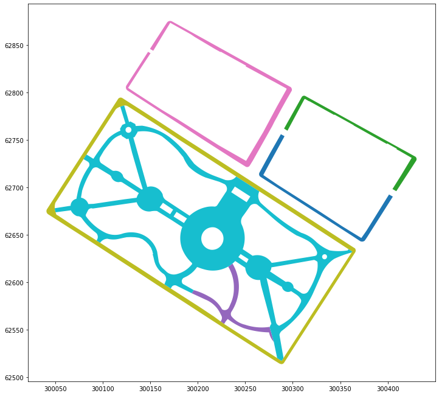
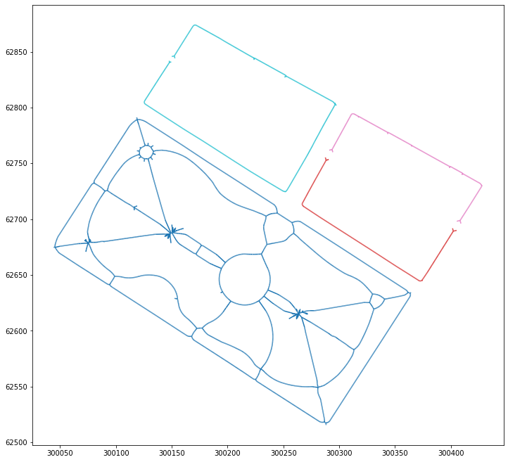
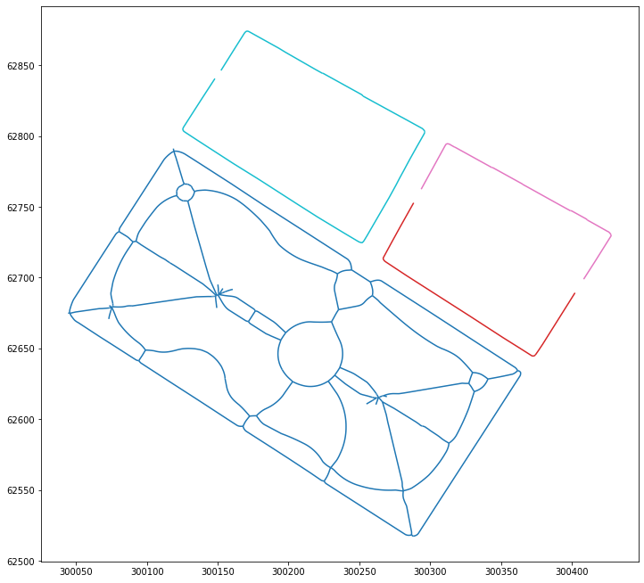
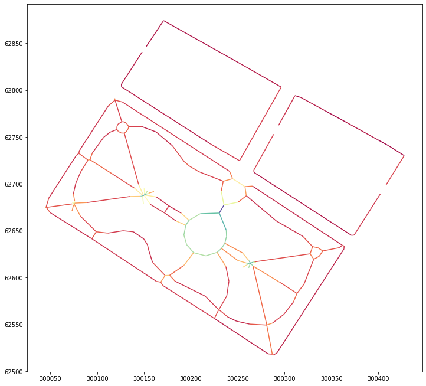

# Sidewalk Widths NYC

Sidewalk Widths NYC uses [New York City's 2024 Sidewalk dataset](https://data.cityofnewyork.us/City-Government/NYC-Planimetric-Database-Sidewalk/vfx9-tbb6) to produce a map of sidewalk widths for the 5 boroughs.

This repo contains the notebooks to reproduce this work, as well as the finished Sidewalk Width dataset in GeoJSON format.

## Link
[www.sidewalkwidths.nyc](http://www.sidewalkwidths.nyc)

## Methodology

1) Polygons from NYC open data




1) Dissolve adjacent sidewalk polygons


2) Find sidewalk centerlines




3) Remove short ends and simplify




4) Measure distance from centerlines to original polygon




## Forking
If you want to make a version of Sidewalk Widths for your own city, just fork this repo and use whatever portion of the code you like. Not all cities will have publicly accessible planimetric sidewalk data, so you may need to produce the sidewalk dataset in a different way (i.e. curbs to parcel boundaries).

The website should work with only a few changes. I've consolidated most of the variables you need to customize in a file called ```settings.js```. It should include things like your Mapbox token, sidewalk width ratings, and units of measurement for you to customize.

### Virtual environment
The fastest way to get your vitual environment configured to run the Jupyter Notebook is by using Anaconda to install the following depedencies. In the Anaconda prompt type the following:

```conda create -n opendata-env -c conda-forge python=3.8 geopandas matplotlib tqdm notebook ipywidgets```

Now activate your virtual environment by typing the following into the Anaconda Prompt and pressing enter.

```conda activate opendata-env```

Finally, install this last python package by typing the following in the Anaconda Prompt and pressing enter.

```pip install centerline```

### Mapbox
Sidewalk widths uses Mapbox for the custom map style and serve the sidewalk widths data as a tileset. If you're creating your own version of the site you must make a Mapbox account and replace the access token with your own. My access token is restricted to the www.sidewalkwidths.nyc URL.

#### Tilesets
To create a tileset from your sidewalk width GeoJSON, following the [Mapbox documentation here](https://docs.mapbox.com/studio-manual/reference/tilesets/).

#### Custom Style
You can copy the [sidewalk widths custom Mapbox style here](https://api.mapbox.com/styles/v1/dcharvey/ck90r78ib0hnp1jnz9bwleg7h.html?fresh=true&title=copy&access_token=pk.eyJ1IjoiZGNoYXJ2ZXkiLCJhIjoiY2s5N3Zjc3ZxMGYwazNlbm9ubzA1d3Q1dCJ9.szxUl4AKCdUNLlmvham6og).
